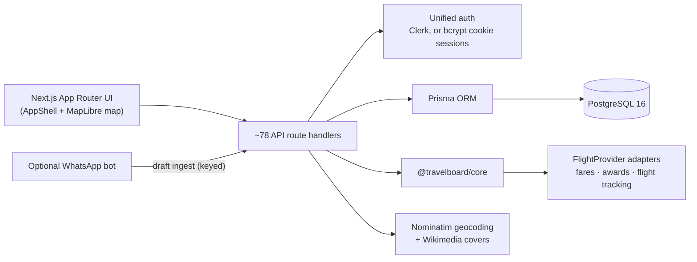

# TravelBoard (June 2026 snapshot)

**A map-first travel journal merged with a flight-deals engine.** This repository captures the moment a personal travel bucket-list map absorbed a fares, points and award-availability engine and became a single "Explore" app.

> **Status: archived snapshot.** This is an intermediate checkpoint of TravelBoard, which later became **TrekMap**. Development continued in the main TravelBoard repository and then in a new TrekMap codebase. The code is kept for reference and is not maintained.

---

## What it does

- **Travel journal on a world map.** Countries glow by how many places you have saved. Click to zoom in, read entries, and add places by search, dropped pin or shared social link.
- **Flight deals on the same map.** Airport dots carry price labels, flight arcs connect you to deals, and countries in your journal are highlighted.
- **Points and awards.** Estimate cents-per-point, find the best credit-card transfer path, track loyalty balances, and surface award seats from an award-availability API.
- **Planning tools.** Trip planner, fare prediction, fare watches and alerts, flight tracker, lounge finder, savings dashboard and packing list.
- **Community.** Shared deal boards with votes and comments, an activity feed and gamification badges.

## App layout

The app is one `AppShell` with seven tabs:

| Tab | Contents |
| --- | --- |
| **Explore** | Unified map: journal glow, deal dots with prices, flight arcs, country side panel |
| **Search** | Fare search with calendar view and deal scoring breakdown |
| **Alerts** | Fare watches and triggered alerts |
| **Journal** | Journal entries, per-country stats, shareable public entries |
| **Tools** | Points Calculator, Transfer Optimizer, Card Manager, Loyalty Tracker, Trip Planner, Fare Prediction, Flight Tracker, Memory Map, Savings Dashboard, Packing List |
| **Community** | Social deal boards, voting and comments |
| **Settings** | Map theme (classic or flag colors), home airports, travel preferences, data export |

## Architecture



- **`@travelboard/core`** is a local TypeScript package shared with the earlier deals-board prototype. It holds the `FlightProvider` interface and adapters, an aggregate provider that merges quotes from several sources into one best offer per destination, fare tiering, distance-banded trip lengths, layover feasibility estimates, and the points valuation engine. It ships with unit tests.
- **Unified auth** (`src/lib/unified-auth.ts`) uses Clerk when its keys are configured and falls back to username/password sessions (bcrypt plus a signed httpOnly cookie) otherwise, so the app runs locally with no third-party account.
- **Provider selection** happens in `src/lib/providers.ts` from environment variables. When no fare keys are set, the defaults need no API key.

## Tech stack

| Layer | Technology |
| --- | --- |
| Web | Next.js 15 (App Router, Turbopack dev), React 19, TypeScript, Tailwind CSS 4 |
| Map | MapLibre GL JS with a CARTO dark basemap (no token) and GeoJSON country boundaries |
| Data | PostgreSQL 16 with Prisma 6 (23 models) |
| Auth | Clerk, with a bcrypt/cookie fallback |
| Images | `sharp`, Wikimedia Commons, and server-side play-button removal for social thumbnails |
| Shared logic | `@travelboard/core` (fares, points, geo, providers) |
| Ops | Docker Compose for Postgres, PM2 process config |

## Repository layout

```
src/app/          pages and API route handlers (app/api)
src/components/   AppShell, map, side panels, deals, tools, community UI
src/lib/          auth, provider setup, geocoding, cover images, link enrichment
packages/core/    @travelboard/core: providers, aggregation, fares, points, geo (with tests)
prisma/           schema, migrations, seed
scripts/          cache warming, deal refresh, WhatsApp bot, maintenance helpers
```

## Running locally

```bash
npm install
cp .env.example .env         # fill in the variables below
docker compose up -d         # optional: local PostgreSQL 16
npx prisma migrate deploy
npm run dev                  # http://localhost:3000
```

Seeding (`npm run db:seed`) only loads demo data into an empty account. Avoid `npx prisma migrate reset` if you want to keep your data.

### Environment variables

Never commit real values.

| Variable | Required | Purpose |
| --- | --- | --- |
| `DATABASE_URL` | yes | PostgreSQL connection string |
| `SESSION_SECRET` | yes | Signs the fallback session cookie |
| `NEXT_PUBLIC_CLERK_PUBLISHABLE_KEY`, `CLERK_SECRET_KEY` | no | Enable Clerk sign-in |
| `TEQUILA_API_KEY`, `SEATSAERO_API_KEY`, `AIRLABS_API_KEY` | no | Fare, award-availability and flight-tracking providers |
| `FLIGHT_API_KEY` | no | API key required to `POST /api/flight-prices` |
| `CACHE_WARM_TOKEN` | no | Session token used by the scheduled `scripts/cache-warm.mjs` fare warmer |
| `WHATSAPP_INGEST_KEY`, `WHATSAPP_OWNER_USERNAME`, `TRAVELBOARD_API` | no | Optional WhatsApp draft-ingest bot |

## Relationship to other repos

| Repo | Role |
| --- | --- |
| `meridian` | Earlier deals-board prototype (wall display + phone app + fare API) where `@travelboard/core` started |
| **`TravelBoard-1`** (this repo) | Snapshot of the first merge of the journal map with the deals engine |
| `TravelBoard` | Continued development: Supabase auth and storage, passport layer, social feed, mobile shells, ESP32 display |
| TrekMap | Successor product, in a new codebase |
